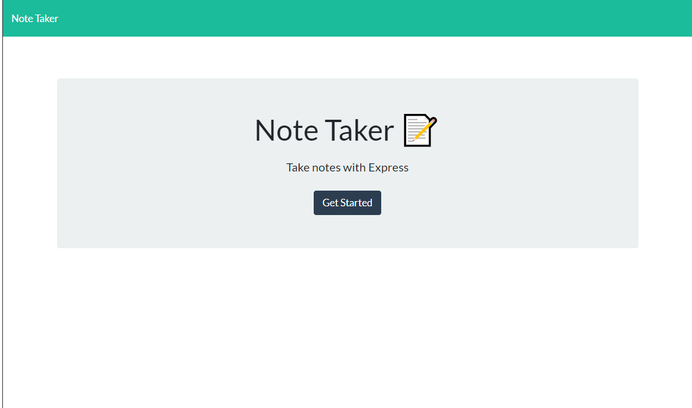
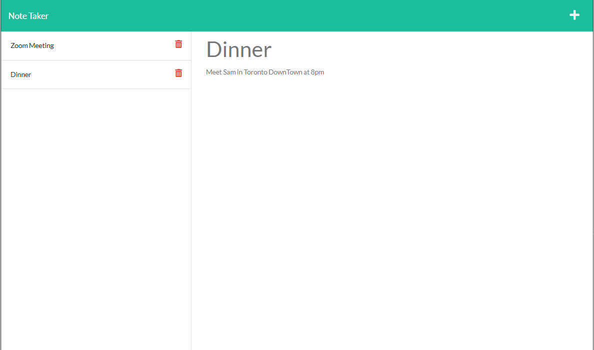

# Note-Taker

## Description

An application that is able to write and save notes so user can organize their thoughts and keep track of tasks they need to complete.
This can be used to write, save and delete notes. This application will use an Express.js back end and will save and retrieve note data from a JSON file.

## Installation

1. To use this appplication, first you need to download or clone this repository 
2. Run it under the node.js environment.  
3. you need to set up the application by running ``npm init -y`` 
4. Then use ``npm install`` to install the npm packages. 
5. Then you could invoke the application by using the following command: ``npm start`` or ``node server.js``
6. Open your browser and go to and go to ``http://localhost:3001/``

## Usage
- run the application by enter ``npm start`` or ``node server.js``

The following image is the sceenshot of application's appearance:

## Contribute

Contributions, issues and feature requests are welcome.
Feel free to check [issues page](https://github.com/JotaroC/Note-Taker/issues) if you want to contribute.

## Questions

Free feel to approach me if you have any further questions or anything want to discuss.
- checkout my [GitHub profile](https://github.com/JotaroC)
- Contact me via [Email](mailto:cxz980314@gmail.com)

## License

Copyright© 2022 JotaroC.
This project is MIT licensed.
    
